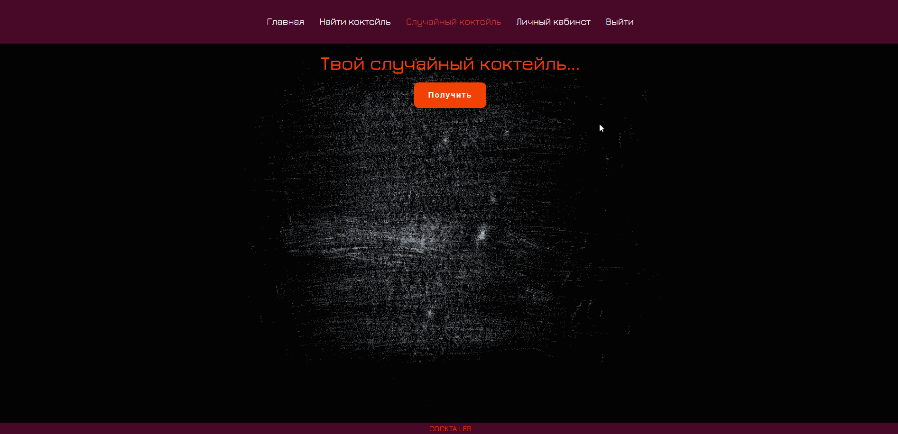

<h1 align="center">COCTAILER :cocktail:</h1>

<h3 align="center">Web-приложение по поиску коктейлей по названию или выбор случайного коктейля. Информация по рецептам коктейлей и необходимым ингридиентам.</h3>

# Запуск проекта

1. В терминале перейти в директорию с проектом;
2. Установить зависимости командой - npm i
3. Запустить приложение и наслаждаться &#129321; - npm run dev

# Стек технологий

# О проекте

### &#128160; На главной странице нас встречает прекрасная анимация текста и шикарный фон с дямящимися коктейлями.

### &#128160; Аутентификация пользователя реализована с помощью JSON Web Token. Валидация форм осуществляется как на стороне клиента, так и на стороне сервера. В случае неправильного заполнения формы или при успешной регистрации пользователь получает соответствующее сообщение. После авторизации пользователю доступен личный кабинет и кнопка "Выйти".

### &#128160; Страница поиска коктейлей позволяет найти любой коктейль из базы данных. На страницу выводятся все совпадения по введенному наименованию.

### &#128160; Страница случайного коктейля позволяет получить случайный коктейль из базы.

# Планы проекта

- Рефакторинг кода;
- Перевод на русский язык рецепта коктейлей и ингредиентов;
- Добавление понравившегося коктейля в избранное;
- Личный кабинет со списком избранных коктейлей;
- Адаптивность.
